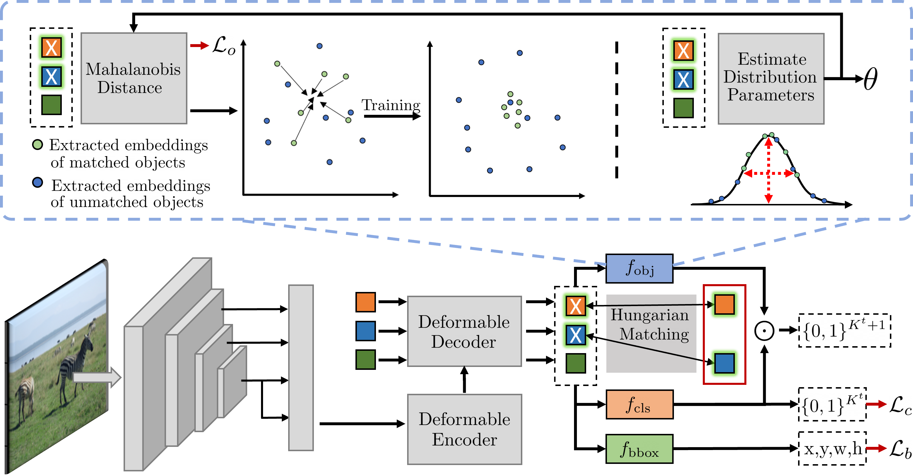

# PROB: Probabilistic Objectness for Open World Object Detection (CVPR 2023)

[`paper`](https://openaccess.thecvf.com/content/CVPR2023/html/Zohar_PROB_Probabilistic_Objectness_for_Open_World_Object_Detection_CVPR_2023_paper.html) 
[`arXiv`](https://arxiv.org/abs/2212.01424) 
[`website`](https://orrzohar.github.io/projects/prob/)
[`video`](https://www.youtube.com/watch?v=prSeAoO82M4)

#### [Orr Zohar](https://orrzohar.github.io/), [Jackson Wang](https://wangkua1.github.io/), [Serena Yeung](https://marvl.stanford.edu/people.html)

<h5 align="center"> If you like our project, please give us a star ⭐ on GitHub for latest updates!  </h2>

## 📰 News
* **[2024.01.05]**  ⏭️ [Check out my new OWOD paper](https://github.com/orrzohar/FOMO), where I attempt to integrate foundation models into the OWOD objective!
* **[2023.06.18]**  🤝 Presenting at CVPR - come check out our poster, and discuss the future of OWOD.
* **[2023.02.27]**  🚀 PROB was accepted to CVPR 2023!
* **[2022.12.02]**  First published on [arXiv](https://arxiv.org/abs/2212.01424).


Certainly! Here's a more concise version of your "Highlights" section:

## 🔥 Highlights
* **Open World Object Detection (OWOD):** A new computer vision task that extends traditional object detection to include both seen and unknown objects, aligning more with real-world scenarios.
* **Challenges with Standard OD:** Traditional methods inadequately classify unknown objects as background, failing in OWOD contexts.
* **Novel Probabilistic Framework:** Introduces a method for estimating objectness in embedded feature space, enhancing the identification of unknown objects.
* **PROB: A Transformer-Based Detector:** A new model that adapts existing OD models for OWOD, significantly improving unknown object detection.
* **Superior Performance:** PROB outperforms existing OWOD methods, doubling the recall for unknown objects and increasing known object detection mAP by 10%.


## Overview
PROB adapts the Deformable DETR model by adding the proposed 'probabilistic objectness' head. In training, we alternate 
between distribution estimation (top right) and objectness likelihood maximization of **matched ground-truth objects** 
(top left). For inference, the objectness probability multiplies the classification probabilities. For more, see the manuscript.



## 📊 Results
<table align="center">
    <tr>
        <th> </th>
        <th align="center" colspan=2>Task1</th>
        <th align="center" colspan=2>Task2</th>
        <th align="center" colspan=2>Task3</th>
        <th align="center" colspan=1>Task4</th>
    </tr>
    <tr>
        <td align="left">Method</td>
        <td align="center">U-Recall</td>
        <td align="center">mAP</td>
        <td align="center">U-Recall</td>
        <td align="center">mAP</td>
        <td align="center">U-Recall</td>
        <td align="center">mAP</td>
        <td align="center">mAP</td>
    </tr>
    <tr>
        <td align="left">OW-DETR</td>
        <td align="center">7.5</td>
        <td align="center">59.2</td>
        <td align="center">6.2</td>
        <td align="center">42.9</td>
        <td align="center">5.7</td>
        <td align="center">30.8</td>
        <td align="center">27.8</td>
    </tr>
    <tr>
        <td align="left">PROB</td>
        <td align="center">19.4</td>
        <td align="center">59.5</td>
        <td align="center">17.4</td>
        <td align="center">44.0</td>
        <td align="center">19.6</td>
        <td align="center">36.0</td>
        <td align="center">31.5</td>
    </tr>
</table>


## 🛠️ Requirements and Installation

### Python Environment

We have trained and tested our models on `Ubuntu 16.04`, `CUDA 11.1/11.3`, `GCC 5.4.0`, `Python 3.10.4`

```bash
conda create --name prob python==3.10.4
conda activate prob
pip install -r requirements.txt
pip install torch==1.12.0+cu113 torchvision==0.13.0+cu113 torchaudio==0.12.0 --extra-index-url https://download.pytorch.org/whl/cu113
```

### Backbone features

Download the self-supervised backbone from [here](https://dl.fbaipublicfiles.com/dino/dino_resnet50_pretrain/dino_resnet50_pretrain.pth) and add in `models` folder.

### Compiling CUDA operators
```bash
cd ./models/ops
sh ./make.sh
# unit test (should see all checking is True)
python test.py
```


## Dataset Preparation
The file structure:
```
PROB/
└── data/
    └── OWOD/
        ├── JPEGImages
        ├── Annotations
        └── ImageSets
            ├── OWDETR
            ├── TOWOD
            └── VOC2007
```

The splits are present inside `data/OWOD/ImageSets/` folder.
1. Download the COCO Images and Annotations from [coco dataset](https://cocodataset.org/#download) into the `data/` directory.
2. Unzip train2017 and val2017 folder. The current directory structure should look like:
```
PROB/
└── data/
    └── coco/
        ├── annotations/
        ├── train2017/
        └── val2017/
```
4. Move all images from `train2017/` and `val2017/` to `JPEGImages` folder.
5. Use the code `coco2voc.py` for converting json annotations to xml files.
6. Download the PASCAL VOC 2007 & 2012 Images and Annotations from [pascal dataset](http://host.robots.ox.ac.uk/pascal/VOC/) into the `data/` directory.
7. untar the trainval 2007 and 2012 and test 2007 folders.
8. Move all the images to `JPEGImages` folder and annotations to `Annotations` folder. 

Currently, we follow the VOC format for data loading and evaluation

## 🤖 Training

#### Training on single node

To train PROB on a single node with 4 GPUS, run
```bash
bash ./run.sh
```
**note: you may need to give permissions to the .sh files under the 'configs' and 'tools' directories by running `chmod +x *.sh` in each directory.

By editing the run.sh file, you can decide to run each one of the configurations defined in ``\configs``:

1. EVAL_M_OWOD_BENCHMARK.sh - evaluation of tasks 1-4 on the MOWOD Benchmark.
2. EVAL_S_OWOD_BENCHMARK.sh - evaluation of tasks 1-4 on the SOWOD Benchmark. 
3. M_OWOD_BENCHMARK.sh - training for tasks 1-4 on the MOWOD Benchmark.
4. M_OWOD_BENCHMARK_RANDOM_IL.sh - training for tasks 1-4 on the MOWOD Benchmark with random exemplar selection.
5. S_OWOD_BENCHMARK.sh - training for tasks 1-4 on the SOWOD Benchmark.

#### Training on slurm cluster

To train PROB on a slurm cluster having 2 nodes with 8 GPUS each (not tested), run
```bash
bash run_slurm.sh
```
**note: you may need to give permissions to the .sh files under the 'configs' and 'tools' directories by running `chmod +x *.sh` in each directory.

### Hyperparameters for different systems

<table align="center">
    <tr>
        <th align="center">System</th>
        <th align="center">Hyper Parameters</th>
        <th align="center">Notes</th>
        <th align="center">Verified By</th>
    </tr>
    <tr>
        <td align="left">2, 4, 8, 16 A100 (40G)</td>
        <td align="center">
            -
        </td>
        <td align="center">-</td>
        <td align="center">orrzohar</td>
    </tr>
    <tr>
        <td align="left">2 A100 (80G)</td>
        <td align="center">
            lr_drop = 30
        </td>
        <td align="center">lower lr_drop required to sustain U-Recall</td>
        <td align="center">https://github.com/orrzohar/PROB/issues/47</td>
    </tr>
    <tr>
        <td align="left">4 Titan RTX (24G)</td>
        <td align="center">
            lr_drop = 40, batch_size = 2
        </td>
        <td align="center">class_error drops more slowly during training.</td>
        <td align="center">https://github.com/orrzohar/PROB/issues/26</td>
    </tr>
    <tr>
        <td align="left">4 3090 (24G)</td>
        <td align="center">
            lr_drop = 35, batch_size = 2
            lr = 1e-4, lr_drop=35, batch_size = 3
        </td>
        <td align="center">Performance drops to K_AP50= 58.338, U_R50=19.443.</td>
        <td align="center">https://github.com/orrzohar/PROB/issues/48</td>
    </tr>
    <tr>
        <td align="left">1 2080Ti(11G)</td>
        <td align="center">
            lr = 2e-5, lr_backbone = 4e-6, batch size = 1, obj_temp = 1.3
        </td>
        <td align="center">Performance drops to K_AP50=57.9826 U_R50=19.2624.</td>
        <td align="center">https://github.com/orrzohar/PROB/issues/50</td>
    </tr>
</table>

## 📈 Evaluation 

For reproducing any of the aforementioned results, please download our [weights](https://drive.google.com/uc?id=1TbSbpeWxRp1SGcp660n-35sd8F8xVBSq) and place them in the 
'exps' directory. Run the `run_eval.sh` file to utilize multiple GPUs.

**note: you may need to give permissions to the .sh files under the 'configs' and 'tools' directories by running `chmod +x *.sh` in each directory.


```
PROB/
└── exps/
    ├── MOWODB/
    |   └── PROB/ (t1.ph - t4.ph)
    └── SOWODB/
        └── PROB/ (t1.ph - t4.ph)
```


**Note:**
Please check the [Deformable DETR](https://github.com/fundamentalvision/Deformable-DETR) repository for more training and evaluation details.


## ✏️ Citation
If you use PROB, please consider citing:

```bibtex
@InProceedings{Zohar_2023_CVPR,
    author    = {Zohar, Orr and Wang, Kuan-Chieh and Yeung, Serena},
    title     = {PROB: Probabilistic Objectness for Open World Object Detection},
    booktitle = {Proceedings of the IEEE/CVF Conference on Computer Vision and Pattern Recognition (CVPR)},
    month     = {June},
    year      = {2023},
    pages     = {11444-11453}
}
```

## 📧 Contact
Should you have any questions, please contact :e-mail: orrzohar@stanford.edu

## 👍 Acknowledgements
PROB builds on previous works' code bases such as [OW-DETR](https://github.com/akshitac8/OW-DETR), [Deformable DETR](https://github.com/fundamentalvision/Deformable-DETR), [Detreg](https://github.com/amirbar/DETReg), and [OWOD](https://github.com/JosephKJ/OWOD). If you found PROB useful please consider citing these works as well.

## ✨ Star History
[](https://star-history.com/#orrzohar/PROB&Date)
